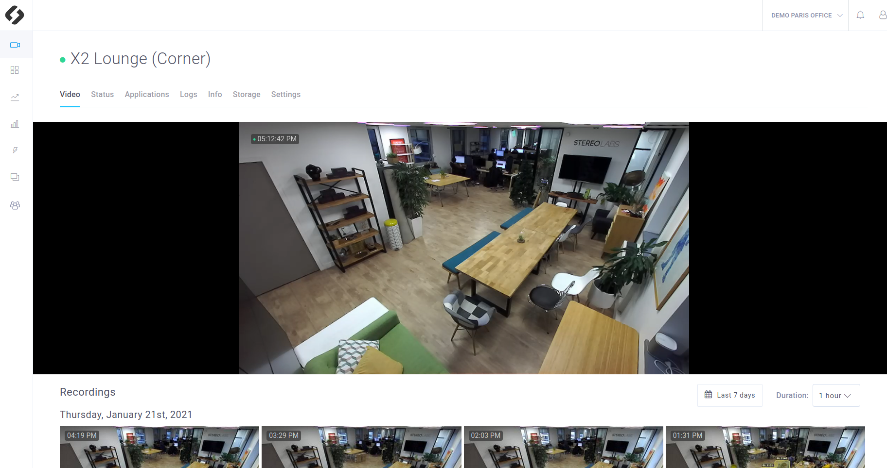
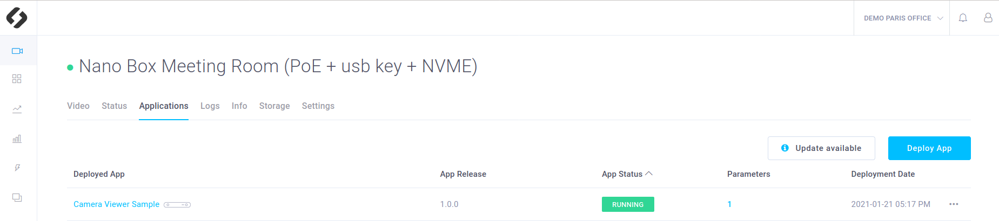
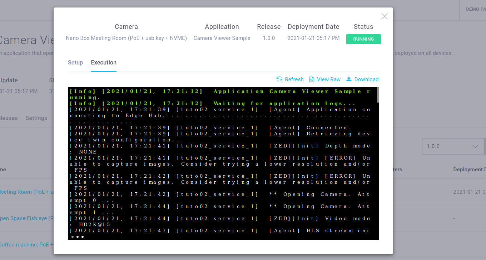

# Camera Viewer

This sample is a basic example which displays a ZED live view in the **ZED Hub Video Panel**. It also allows you to continuously record the video. This sample showcases the following ZED Hub features :
- **Logs** which informs you about the app's status
- **Live Stream** which displays the live video from your ZED camera in the **Video Panel**
- **Recordings** which are listed hour by hour in the **Video Panel**




## Requirements
This sample uses a part of the **basic tutorials** provided in the `tutorials` folder. We recommend to **read and test the first 3 tutorials** before running this sample. These tutorials provide a lot of information on the ZED Hub features and will make it easier to understand the **Camera Viewer Sample**.

You will deploy these tutorials on a device installed on your ZED Hub workspace. ZED Hub supports Jetson L4T and Ubuntu operating systems. If you are using a Jetson, make sure it has been flashed beforehand. If you haven't done it already, please take a look at the NVIDIA documentation to [flash your Jetson](https://docs.nvidia.com/sdk-manager/install-with-sdkm-jetson/index.html).

To be able to run this tutorial:
- [Sign in to ZED Hub and create a workspace](https://www.stereolabs.com/docs/cloud/overview/get-workspace/).
- [Add and setup a device](https://www.stereolabs.com/docs/cloud/overview/setup-device/).
- A ZED camera must be plugged to this device.
- **Enable recordings** and **disable privacy mode** in the Settings panel of your device.


## Build and deploy this tutorial

### How to build your application (for development)

Run the Edge Agent installed on your device using :
```
$ edge_cli start
```

Then to build your app :
```
$ cd sources
$ mkdir build
$ cd build
$ cmake ..
$ make -j$(nproc)
```


This application defines application parameters in order to modify its behavior while it is running. Move the `parameters.json` file to the path you specified in the `HubClient::loadApplicationParameters` function.
```
$ cp ../parameters.json .
```

Then to run your app :
```
./Camera_Viewer_Sample
```

To dynamically change the parameters and activate their callbacks, edit the `parameters.json` file.

### How to build your application (for service deployment)
To build your app just run:

```
$ cd /PATH/TO/camera_viewer_sample
$ edge_cli build .
```

This command is available by installing Edge Agent on your device.

- The command will ask for the **device type** (Jetson or x86) on which you want to deploy this app.
- The command will also ask for your **device cuda version**. If you do not know it you can find it in the **Info** section of your device in the ZED Hub interface.
- Finally you will be asked the **sl_iot version** you want to use. The default one is the one installed on your device with Edge Agent. It corresponds to the base docker image used to build your app docker image. You can chose the default one, or look for the [most recent version available on Docker Hub](https://hub.docker.com/r/stereolabs/iot/tags?page=1&ordering=last_updated).

### How to deploy your application

After packaging your app by generating a `app.zip`, you can now [deploy your app](https://www.stereolabs.com/docs/cloud/applications/deployment/) using the ZED Hub interface:

- In your workspace, in the **Applications** section, click on **Add application** 
- Select the ZIP file containing the application in your filesystem
- Select the devices on which you want to deploy the app and press **Upload app** 


## What you should see after deployment
Make sure that the recordings are enabled and that the privacy mode is disabled (**Settings panel** of your device, in the ZED Hub interface).
Thanks to this app you will have access to:
- a **Live Stream** that shows you the live video
- **Recordings** listed in the **Video panel**
- **Logs** that informs you about the app's status


### Live video
In the **Settings panel** of your device, make sure that the **Privacy mode** is disabled, otherwise the video won't be visible.
Wait at least until your app is **running**. 



In the **Devices** panel, select the device which is running your app. You should see the live video displayed in real-time.


### Recordings

In the **Settings** panel of your device, make sure that the **Enable Recording** parameter is set to `True`, otherwise the video won't be recorded. Keep **Recording Mode** on **Continuous**, which will make the camera record as long as the application is running. The only limit is your device Hard Drive storage. When there is no space left on it, the older recordings are **erased**. See [tutorial_06_video_event](/tutorials/tutorial_06_video_event/README.md) to understand the **On Event** recording mode.

That's it, recording is active! The recordings are listed by hour and day in the **Video panel** of your device. 


###  App logs
Once the application is running, go to the **Logs** section on your device. You should be able to see logs associated to this application.


### Terminal logs
If you click on the app status, you will have access to the app **logs in a terminal**, both for the building and the running stage.




## Code overview


### Parameters callback
Some callbacks are defined and will be called when a parameter will be modified through the interface. They are used to modify a parameter value and notify that the change has been done.

> **Note**: There are two types of parameters : the **device parameters** and the **app parameters**.
The device parameters can be modified in the settings panel of the device. However to be notified of the modification, the **Camera Viewer app** must define a callback associated with the parameter.

The app parameters can be modified in the parameters pop up window. They also need to be associated to a callback and must be declared as explained in the [**tutorial_03_telemetries**](/tutorials/tutorial_03_telemetries/README.md).


```c++
void onLocalStreamUpdate(FunctionEvent &event)
{
    event.status = 0;
    bool local_stream = HubClient::getParameter<bool>("local_stream", PARAMETER_TYPE::APPLICATION, false);

    if (local_stream)
    {

        sl::StreamingParameters stream_param;
        stream_param.codec = sl::STREAMING_CODEC::H264;

        // restart streaming with new parameters
        p_zed->disableStreaming();
        auto zed_error = p_zed->enableStreaming(stream_param);
        if (zed_error != sl::ERROR_CODE::SUCCESS)
        {
            std::cout << "[onAppStreamParamUpdate] " << sl::toVerbose(zed_error) << "\nExit program." << std::endl;
            p_zed->close();
            exit(EXIT_FAILURE);
        }
    }
    else
    {
        p_zed->disableStreaming();
    }
}
```


### Initialization and 'restart' loop

This sample app starts init the cloud and start the ZED in a first loop that you can consider as a 'restart loop': if the ZED fails, the loop is re-entered and the ZED restart.

What exactly appends:

- Initialize communications with the cloud.

```cpp
    // Create ZED Object
    p_zed.reset(new sl::Camera());

    STATUS_CODE status_iot;
    status_iot = HubClient::connect("camera_viewer");
    if (status_iot != STATUS_CODE::SUCCESS)
    {
        std::cout << "Initialization error " << status_iot << std::endl;
        exit(EXIT_FAILURE);
    }
```

- Open the ZED with `p_zed->open(initParameters)` in the restart loop but before the main loop ([ZED Documentation](https://www.stereolabs.com/docs/video/camera-controls/#camera-configuration)).

```cpp
    // Open the ZED camera
    sl::ERROR_CODE err_zed = p_zed->open(initParameters);
    if (err_zed != sl::ERROR_CODE::SUCCESS)
    {
        HubClient::sendLog("Camera initialization error : " +
                               std::string(toString(err_zed)),
                           LOG_LEVEL::ERROR);
        exit(EXIT_FAILURE);
    }

    // Register the camera once it's open
    UpdateParameters updateParameters;
    status_iot = HubClient::registerCamera(p_zed, updateParameters);
    if (status_iot != STATUS_CODE::SUCCESS) {
        std::cout << "Camera registration error " << status_iot << std::endl;
        exit(EXIT_FAILURE);
    }
```

- Setup the parameters callback before the main loop

```c++        
        ...
    // Setup callback for parameters
    CallbackParameters callback_param;
    callback_param.setParameterCallback("onParamChange",
                                        "camera_resolution|camera_fps|camera_image_flip",
                                        CALLBACK_TYPE::ON_PARAMETER_UPDATE,
                                        PARAMETER_TYPE::DEVICE);
    HubClient::registerFunction(onInitParamUpdate, callback_param);
        ...
```

### Main loop
- In the main loop, grab a new frame and call `HubClient::update()`. Note that the `update` is responsible for both **live stream** and **recording**. The sent image corresponds to the grabbed image, so to current frame.


```c++
    HubClient::update(p_zed);
```
