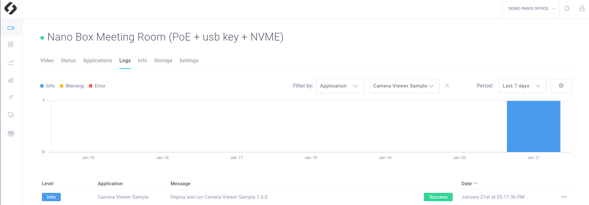

# Camera Viewer

This sample is a basic exemple that shows you how to display your ZED live view in the CMP Video Panel. It also allows you to continuously record the video. This sample use and explain the following features of the CMP:
- **Logs** that informs you about the app's status
- **Live Stream** that shows you the live video from your zed in the **Video** Panel
- **Recordings** that are listed hour by hour in the **Video** Panel


**Note** That this sample ecactly correpond to the Camera Viewer app that is provided by default when you setup a new device.


## Requirements
This sample uses a part of the **7 basic tutorials** provided in the `tutorials` folder. You are advice to **read and test the 3 first tutorials** before running this sample. These tutorials provide many information on the CMP features and will make it easier to understand the **Camera Viewer Sample**.  

You will deploy this tutorial on one of the devices installed on your CMP workspace. The CMP supports Jetson Nano, TX2 and Xavier or any computer. If you are using a Jetson, make sure it has been flashed. If you haven't done it already, [flash your Jetson](https://docs.nvidia.com/sdk-manager/install-with-sdkm-jetson/index.html).

To be able to run this tutorial:
- [Sign In the CMP and created a workspace](https://www.stereolabs.com/docs/cloud/overview/get-started/).
- [Add and Setup a device](https://www.stereolabs.com/docs/cloud/overview/get-started/#add-a-camera).
- A ZED must be plugged to this device.
- **Enable recordings** and **disable privacy mode** in the Settings panel of your device


## Build and deploy this tutorial

### How to build your application (for development)

Run the Edge Agent installed on your device using :
```
$ edge_agent start
```

Then to build your app :
```
$ cd sources
$ mkdir build
$ cd build
$ cmake ..
$ make -j$(nproc)
```

This application use application parameters. Move the `parameters.json` file to the path you specified in the `IoTCloud::loadApplicationParameters` function.
```
$ cp ../parameters.json .
```

Then to run your app :
```
./app_executable
```

To dynamically change the parameters and activate callbacks, edit the `parameters.json` file.

### How to build your application (for service deployment)
To build your app just run:

```
$ cd /PATH/TO/camera_viewer_sample
$ edge_agent build
```

This command is available by installing Edge Agent on your device.

- The command will ask for the **device type** (jetson or classic x86 computer) on which you want to deploy this app. **Note** that it may be different than the computer on which you run `edge_agent build`.
- The command will also ask for your **device cuda version**. If you do not know it you can find it in the **Info** section of your device in the CMP interface.
- Finally you will be asked the **IOT version** you want to use. The default one is the one installed on your device with Edge Agent. It corresponds to the base docker imaged used to build your app docker image. You can chose the default one, or look for the [most recent version available on Dockerhub](https://hub.docker.com/r/stereolabs/iot/tags?page=1&ordering=last_updated).

### How to deploy your application

Packages your app by generating a app.zip file using :

```
$ edge_agent build
```

Now you just need to [deploy your app](https://www.stereolabs.com/docs/cloud/applications/sample/#deploy) using the CMP interface:

- In your workspace, in the **Applications** section, click on **Create a new app** 
- Get the .zip an Drag’n’Drop in the dedicated area
- Select the devices on which you want to deploy  the app and press **Deploy** 


## What you should see after deployment
Make sure that the recordings are enable and that the privacy mode is disabled (Settings panel of your device, in the CMP interface).
thanks to this app you will have access to:
- a **Live Stream** that shows you the live video
- **Recordings** listed in the **Video** panel by our
- **Logs** that informs you about the app's status


### Live video
In the **Settings** panel of your device, make sure that the **Privacy mode** is disabled, otherwisethe video won't be visible.
Wait at least until your app is **running**. 


If you click in the **Devices** panel  on the device where the app is deployed, you should see the live video (with a delay of a few seconds).


### Recordings

In the **Settings** panel of your device, make sure that the **Enable Recording** parameter is set to True, otherwise the video won't be recorded. Keep **Recording Mode** on **Continuous**. It means that everything will be recorded. The only limit is your device Hard Drive storage. When there is no space left on it, the older recordings are **definitly erased**. (see tutorial_07_video_event to understand the **On Event** recording mode).

It is the only thing to do to start recording. The recordings are listed by hour and day in the **Video** panel of your device. 


###  App logs
Wait until your app is **running**.
If you click  on the device where the app is deployed and go in the **Logs** section, you should see the logs associated to this application. If everything went well, you should see this: 




### Terminal logs
If you click on the app status, you will have access to the app **logs in a terminal**, both for the building and the running stage.


## Code overview


### Parameters callback
Some callback are defined and will be called when a parameter will be modified through the interface. The are used to modify the parameter value and to notify that the change has been done.

Note that there are two types of parameters : the **device parameters** and the **app parameters**.
The device parameters can be modified in the settings panel of the device. However to be notify of the modification, the Camera Viewer app must have callbacks

The app parameters can be modified in the parameters pop up window. They also need to be associated to a callback and must be declared as explained in the **tutorial_03_telemetries**.


```c++
void onLocalStreamUpdate(FunctionEvent &event) {
    event.status = 0;
    local_stream_change = true;
    bool local_stream = IoTCloud::getParameter<bool>("local_stream", PARAMETER_TYPE::APPLICATION, false);

    if (local_stream){

        StreamingParameters stream_param;
        stream_param.codec = sl::STREAMING_CODEC::H264;

        //restart streaming with new parameters
        p_zed->disableStreaming();
        auto zed_error = p_zed->enableStreaming(streaming_param);
        if (zed_error != ERROR_CODE::SUCCESS) {
            std::cout << "[onAppStreamParamUpdate] "<<sl::toVerbose(zed_error) << "\nExit program." << std::endl;
            p_zed->close();
            exit(EXIT_FAILURE);
        }
    }
    else{
        p_zed->disableStreaming();
    }
}
```


### Initialisation and 'restart' loop

This sample app starts Init the cloud and start the ZED in a first loop that you can concider as a 'restart loop': if the ZED fails, the loop is re-entered and the ZED restart.

What exactly appends:

- Init IOT to enable communications with the cloud.

```cpp
    p_zed.reset(new sl::Camera());

    //Init sl_iot
    const char * application_token = ::getenv("SL_APPLICATION_TOKEN");
    STATUS_CODE status_iot = IoTCloud::init(application_token, p_zed);
```


- Open the ZED with `p_zed->open(initParameters)` in the restart loop but before the main loop. [ZED Documentation](https://www.stereolabs.com/docs/video/camera-controls/#camera-configuration)

```cpp
    //Open the ZED camera
    sl::ERROR_CODE errZed = p_zed->open(initParameters);
```

- Setup the parameters callback before the main loop

```c++        
        ... 
    CallbackParameters callback_param;
    callback_param.setParameterCallback("onParamChange", "camera_resolution|camera_fps|camera_image_flip" ,CALLBACK_TYPE::ON_PARAMETER_UPDATE, PARAMETER_TYPE::DEVICE);
    IoTCloud::registerFunction(onInitParamUpdate, callback_param);
        ...
```

### Main loop
- In the main loop, grab a new frame and call `IoTCloud::refresh()`. Note that the `refresh` is responsible for both **live stream** and **recording**. The image sent correspond of course to the image grabed, so to current frame.


```c++
    IoTCloud::refresh();
```

Some logs are also sent if the grab FPS is too low for a too long time.

```c++
if (frame > 40) {
    if (grab_fps <= 5) {
        switch(grab_fps_warning_state){
        case 0:
            timestamp_warning_grab_fps = p_zed->getTimestamp(sl::TIME_REFERENCE::CURRENT).getMilliseconds();
            grab_fps_warning_state=1;
            break;
        case 1:
            if (p_zed->getTimestamp(sl::TIME_REFERENCE::CURRENT).getMilliseconds()-timestamp_warning_grab_fps>5*1000) { //warning if too low during at least 5 seconds
                IoTCloud::log("Grab fps low " + to_string((int)grab_fps), LOG_LEVEL::WARNING);
                grab_fps_warning_state=2;
            }
            break;
        default:
            break;
        }
    } else grab_fps_warning_state = 0;
}
```
