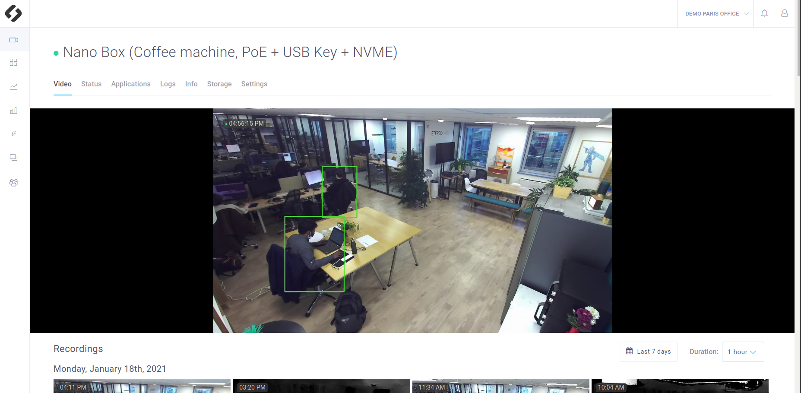
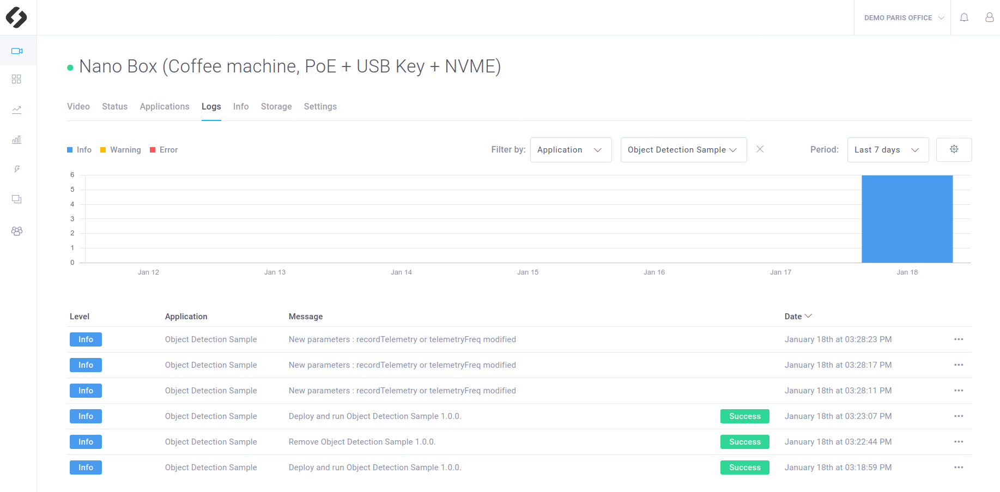
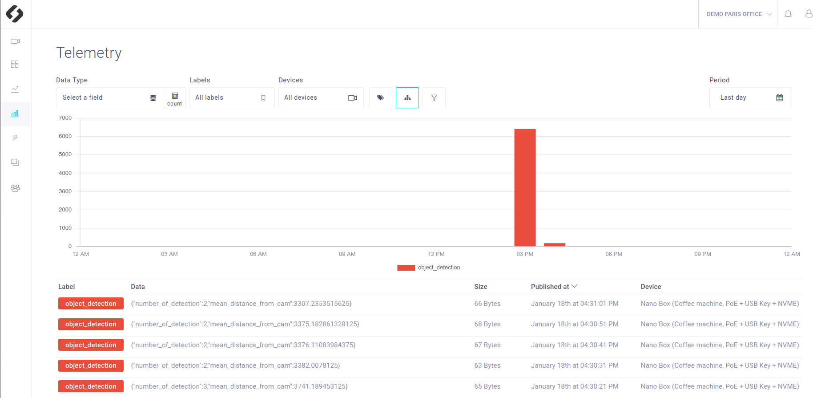
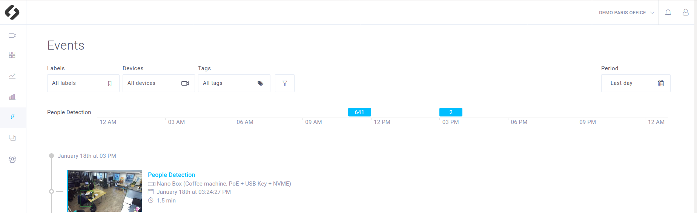
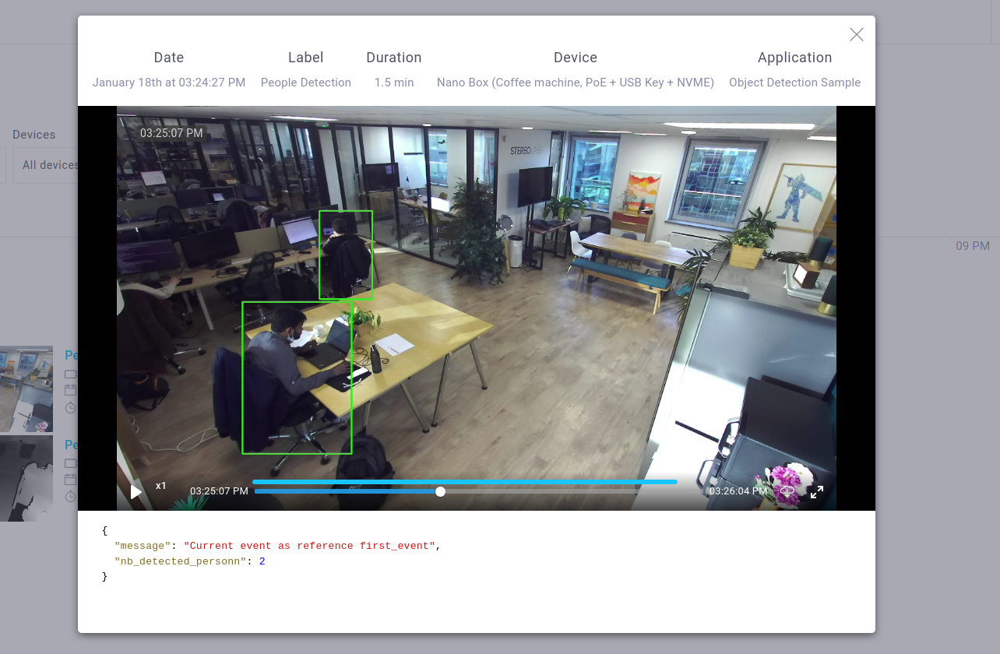
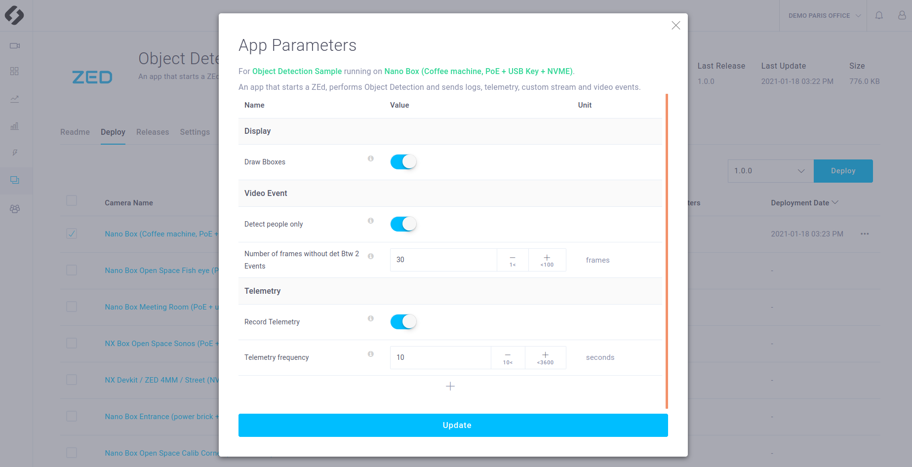

# Object Detection

This sample is a complete example that shows you how to perform Object detection in a ZED Hub App. It also shows how to use it to generate:
- **Logs** that informs you about the app's status
- **Telemetry** that stores data linked to the detections
- **Video Event** that shows you the video on which someone is detected
- **Custom Stream** that shows you the live video, with bbox around the detected people

The app also have several **parameters** that can be modified in the ZED Hub interface and will have an impact on the application.




## Requirements
This sample is a mix of the **basic tutorials** provided in the `tutorials` folder. We recommend to **read and test them** before running this sample. These tutorials provide a lot of information on the ZED Hub features and will make it easier to understand the **Object Detection Sample**.  

You will deploy this tutorial on one of the devices installed on your ZED Hub workspace. The ZED Hub supports Jetson Nano, TX2 and Xavier or any computer. If you are using a Jetson, make sure it has been flashed. If you haven't done it already, [flash your Jetson](https://docs.nvidia.com/sdk-manager/install-with-sdkm-jetson/index.html).

To be able to run this tutorial:
- [Sign In the ZED Hub and create a workspace](https://www.stereolabs.com/docs/cloud/overview/get-started/).
- [Add and Setup a device](https://www.stereolabs.com/docs/cloud/overview/get-started/#add-a-camera).
- A ZED must be plugged to this device.
- **Enable recordings** and **disable privacy mode** in the Settings panel of your device


## Build and deploy this tutorial

### How to build your application (for development)

Run the Edge Agent installed on your device using :
```
$ edge_cli start
```

Then to build your app :
```
$ cd sources
$ mkdir build
$ cd build
$ cmake ..
$ make -j$(nproc)
```

This application use application parameters. Move the `parameters.json` file to the path you specified in the `HubClient::loadApplicationParameters` function.
```
$ cp ../parameters.json .
```

Then to run your app :
```
./app_executable
```

To dynamically change the parameters and activate callbacks, edit the `parameters.json` file.

### How to build your application (for service deployment)
To build your app just run:

```
$ cd /PATH/TO/camera_viewer_sample
$ edge_cli build
```

This command is available by installing Edge Agent on your device.

- The command will ask for the **device type** (jetson or classic x86 computer) on which you want to deploy this app. **Note** that it may be different than the computer on which you run `edge_cli build`.
- The command will also ask for your **device cuda version**. If you do not know it you can find it in the **Info** section of your device in the ZEDHub interface.
- Finally you will be asked the **IOT version** you want to use. The default one is the one installed on your device with Edge Agent. It corresponds to the base docker imaged used to build your app docker image. You can chose the default one, or look for the [most recent version available on Dockerhub](https://hub.docker.com/r/stereolabs/iot/tags?page=1&ordering=last_updated).

### How to deploy your application

Packages your app by generating a app.zip file using :

```
$ edge_cli build
```

Now you just need to [deploy your app](https://www.stereolabs.com/docs/cloud/applications/sample/#deploy) using the ZED Hub interface:

- In your workspace, in the **Applications** section, click on **Create a new app** 
- Get the .zip an Drag’n’Drop in the dedicated area
- Select the devices on which you want to deploy  the app and press **Deploy** 


## What you should see after deployment
Make sure that the recordings are enabled and that the privacy mode is disabled (Settings panel of your device, in the ZED Hub interface).
As this app shows you most of the ZED Hub features, you will have:
- a **Custom Stream** that shows you the live video, with bbox around the detected people
- **Logs** that informs you about the app's status
- **Telemetries** that store data linked to the detections
- **Video Events** that shows you the video on wich someone is detected

The app also have several **parameters** that can be modified in the ZED Hub interface and will have an impact on the application.

### Custom stream

A video with bounding boxes around people should be available in the **Video** panel


### Logs
The logs should inform you about the app status.



### Telemetry
The telemetries containing data about detection should be available and generated every 10 seconds by default.



### Video Event

A video is considered as event if **at least on person is detected** in the image. Therefore if your app is running and that someone is seen by your ZED, you should see an Event in the Video Event panel corresponding to this situation.



You can click on it. You have access to the video and the stored data of the event. You have access to a longer video than the exact event duration ( you can watch a few seconds before and after the event). The blue line indicates which part of the video is associated with the event.



### Parameters

Five parameters can be used to modify your app behaviour:

- **Draw Bboxes**: If selected, will draw boxes around detected people in on the camera live view

- **Enable Video Events**:  If selected some video Event will be recorded when someone is detected on the video

- **Number of frames without det Btw 2 Events**:  Number of frames without detection between two video events: if no one is seen for the defined number of frames, the next time that person is detected a new event is defined instead of continuing the previous event


- **Record Telemetry**:   If selected, the app will send the number of people detected and other info as telemetry.

- **Telemetry frequency**:   Telemetry frequency defines how often telemetry is generated by the app. Every 10 seconds by default.




## Code overview


### Parameters callback
Some callbacks are defined and will be called when a parameter will be modified through the interface. The are used to modify the parameter value and notify that the change has been done.

Callback for `draw_bboxes` parameter
```c++
void onDisplayParametersUpdate(FunctionEvent &event) {
    event.status = 0;
    draw_bboxes = HubClient::getParameter<bool>("draw_bboxes", PARAMETER_TYPE::APPLICATION, draw_bboxes);
    HubClient::sendLog("New parameter : draw_bboxes modified",LOG_LEVEL::INFO);

}
```


### Initialisation
As usual, the app is init with `HubClient::connect` and `HubClient::registerCamera` and the ZED is started with  the ZED SDK `open` function.
The Object detection is enabled with `enableObjectDetection`. Note that the tracking is required to use it(`enablePositionalTracking` must be called).

```c++
    auto zed_error =  p_zed->enablePositionalTracking(trck_params);
    ...
    auto zed_error = p_zed->enableObjectDetection(obj_det_params);
```

The detection is limited to PERSON (meaning that the Vehicles for instance are ignore), the detection threshold is set to 50:

```c++
    // Object Detection runtime parameters : detect person only
    objectTracker_parameters_rt.detection_confidence_threshold = 50;
    objectTracker_parameters_rt.object_class_filter.clear();
    objectTracker_parameters_rt.object_class_filter.push_back(sl::OBJECT_CLASS::PERSON);
```

The  parameters are associated to the callbacks that have been defined above. Here the callback `onDisplayParametersUpdate`is associated to `draw_bboxes`. It will be called when `draw_bboxes` will be modified.

```c++
    CallbackParameters callback_display_param;
    callback_display_param.setParameterCallback("onDisplayParametersUpdate", "draw_bboxes", CALLBACK_TYPE::ON_PARAMETER_UPDATE, PARAMETER_TYPE::APPLICATION);
    HubClient::registerFunction(onDisplayParametersUpdate, callback_display_param);
```


### Main loop

Each time a frame is successfuly **grabbed**, the detected objects are retrieved by the `retrieveObjects` function and stored in `objects`.

Then you will find the features described in the tutorials:

- **Video events** are defined exactly in the same way than in `tutorial_06_video_event`

```c++
sl::Timestamp current_ts = objects.timestamp;
if (recordVideoEvent && objects.object_list.size() >= 1){
    bool is_new_event = true;
    if (counter_no_detection >= nbFramesNoDetBtw2Events){
        event_reference = "detected_person_" + std::to_string(current_ts.getMilliseconds()); 
        HubClient::sendLog("New Video Event defined",LOG_LEVEL::INFO);

    }
    else{
        // Do nothing, keep previous event reference --> The current frame will be defined as being part of the previous video event  
        is_new_event = false;
    }
    EventParameters event_params;
    event_params.timestamp = current_ts.getMilliseconds();
    event_params.reference = event_reference;    
    std::string event_label = "People Detection"; // or label of your choice
    json event2send; // Use to store all the data associated to the video event. 
    event2send["message"] = "Current event as reference " + event_reference;
    event2send["nb_detected_personn"] = objects.object_list.size();
    if (is_new_event || (event_reference == "first_event" && !first_event_sent)) {
        HubClient::startVideoEvent(event_label, event2send, event_params);
        first_event_sent = true;
    }
    // update every 10 s
    else if ((uint64) (current_ts.getMilliseconds() >= (uint64) (prev_timestamp.getMilliseconds() + (uint64)10 * 1000ULL)))
    {
        HubClient::updateVideoEvent(event_label, event2send, event_params);
    }

    counter_no_detection = 0; //reset counter as someone as been detected
}
else {
    counter_no_detection ++;
}

```


- A **custom stream** is sent using the RGB image and OpenCV. To send a custom stream, just add the `sl::Mat` as argument of `update()`.

```c++
if(draw_bboxes){
    p_zed->retrieveImage(imgLeftCustom, sl::VIEW::LEFT, sl::MEM::CPU, imgLeftCustom.getResolution());


    float ratio_x = (float)leftImageCpuCV.cols/(float)image_raw_res.width;
    float ratio_y = (float)leftImageCpuCV.rows/(float)image_raw_res.height;


    for (int i= 0;i< objects.object_list.size();i++) {
        if (objects.object_list[i].tracking_state == sl::OBJECT_TRACKING_STATE::OK) {
            sl::uint2 tl = objects.object_list[i].bounding_box_2d[0];
            sl::uint2 br = objects.object_list[i].bounding_box_2d[2];
            cv::Rect ROI = cv::Rect(cv::Point2i(tl.x*ratio_x, tl.y*ratio_y), cv::Point2i(br.x*ratio_x, br.y*ratio_y));
            cv::Scalar color = cv::Scalar(50, 200, 50, 255);
            cv::rectangle(leftImageCpuCV, ROI, color,2);
        }
    }

    HubClient::update(imgLeftCustom);
}
```


- **Telemetries** relative to the detected objects are defined and sent. See `tutorial_03_telemetries`

```c++
sl::Timestamp curr_timestamp = p_zed->getTimestamp(sl::TIME_REFERENCE::IMAGE);
if (recordTelemetry && (uint64) (curr_timestamp.getMilliseconds() >= (uint64) (prev_timestamp.getMilliseconds() + (uint64)telemetryFreq * 1000ULL))) {
    float mean_distance = 0;
    // compute objects ( = people)  mean distance from camera. This value will be sent as telemetry  
    for (int i= 0;i< objects.object_list.size();i++) {
        mean_distance += (objects.object_list[i].position).norm();
    }

    if (objects.object_list.size() > 0 ){
        mean_distance /= (float) objects.object_list.size();
    }

    // Send Telemetry
    sl_iot::json position_telemetry;
    position_telemetry["number_of_detection"] = objects.object_list.size();
    position_telemetry["mean_distance_from_cam"] = mean_distance;
    HubClient::sendTelemetry("object_detection", position_telemetry);
    prev_timestamp = curr_timestamp;
}
```

