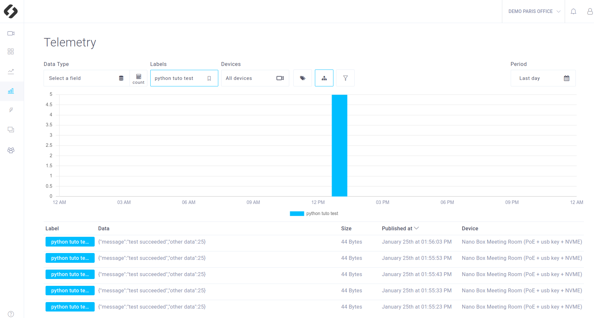

# **Tutorial 01 : Logs and Telemetry**

This tutorial shows you how to create a simple app that send **logs** and **telemetry** to the cloud. Telemetry can be used to **store data** and logs to **report your app status**.

## Requirements
You will deploy this tutorial on one of the devices installed in **your CMP workspace**. The CMP supports Jetson Nano, TX2 and Xavier or any computer. If you are using a Jetson, make sure it has been flashed. If you haven't done it already, [flash your Jetson](https://docs.nvidia.com/sdk-manager/install-with-sdkm-jetson/index.html).

To be able to run this tutorial:
- [Sign In the CMP and created a workspace](https://www.stereolabs.com/docs/cloud/overview/get-started/).
- [Add and Setup a device](https://www.stereolabs.com/docs/cloud/overview/get-started/#add-a-camera).

Note that you do not need a ZED to run this tutorial.

## package and deploy this tutorial

### How to Package your application
To packege your app just run:

```bash
$ cd /PATH/TO/tutorial_01_logs_and_telemetry
$ ./cmp_builder.sh
```

### How to deploy your application
`cmp_builder.sh` packages your app by generating an app.zip file. 
Now you just need to [deploy your app](https://www.stereolabs.com/docs/cloud/applications/sample/#deploy) using the CMP interface:

- In your workspace, in the **Applications** section, click on **Create a new app** 
- Get the .zip an **Drag’n’Drop** in the dedicated area
- Select the devices on which you want to deploy the app and press **Deploy** 

**Additional information about deployment and CMP apps :**

This README only focus on the source code explaination and the way to deploy the app without giving technical explaination about the app deployment. 
Please refer to the main README of this repository if you want more information about the CMP apps structure and technical precisions.  


## What you should see after deployment
This app is a simple app that only send **logs and telemetry** to the cloud

###  App status
On the CMP interface you can consult the available applications list on your device. To do so, go in the Device panel. Click on the device where the app is deployed and go in the application section.
You should find a line corresponding to this tutorial, **"Tutorial 01 - Basic App"**.
The App status is displayed and indicates if your app is:
- Stopped
- Building
- Running
- Failed

Therefore you should see that the app is first in **building** state (for the first deployment it can last one minute or two) and finally **running**. 


### Terminal logs
If you click on the app status, you will have access to the app **logs in a terminal**, both for the building and the running stage.


###  App logs
Wait until your app is **running**.
If you click  on the device where the app is deployed and go in the **Logs** section, you should see three logs associated to this tutorial:
- "Initialization succeeded"
- "Application connected"
- "Log 1 sent" and a new one every 15 seconds.


###  Telemetry
If you click go in the **Telemetry** panel, you should see the telemetry sent by the app as follow:


Not that you can send much more complex messages

## The Source Code explained

Setup a MQTT client that will publish logs and telemetry on the good topics. These topics must be : 

```python
logs_topic = "/v1/devices/" + device_id + "/logs"
telemetry_topic = "/v1/devices/" + device_id + "/telemetry"
```

```python
    #################       MQTT           ##################
    ## Starts alert mqtt client
    client.username_pw_set(mqtt_user, password=app_token)  # set username and password

    client.on_connect = on_connect  # attach function to callback
    client.on_disconnect = on_disconnect  # attach function to callback
    client.on_message = on_message  # attach function to callback
    client.on_publish = on_publish  # attach function to callback

    print("Connecting to broker")
    client.connect(broker_address, port=mqtt_port)  # connect to broker

    #################        start MQTT CLIENT thread            ##################
    client.loop_start()
```

In a while loop, a log and a telemetry are sent every 10 seconds.
```python
    #################                   ##################
    while True:
        time.sleep(10)
        current_time = time.time() # seconds

        log_message = generate_log_message(level = "INFO", message = "test succeeded")
        client.publish(logs_topic, log_message)

        telemetry_message = generate_telemetry_message(label = "python tuto test", message = "test succeeded")
        client.publish(telemetry_topic, telemetry_message)

    return 0
```


A log is a json sent on the logs_topic. It must match the folowing shape:
 ```
 {
    'timestamp': 1611577851463, 
    'label': 'Python log test', 
    'level': 'INFO', 
    'payload': {'message': 'test succeeded'}, 
    'application_name': 'Python logs and telemetry',
    'application_token': 'CfcpNiAN6aZ38QT'
}
```

A telemetry is a json sent on the telemetry_topic. It must match the folowing shape:
 ```
 {
    'timestamp': 1611577851463, 
    'label': 'Python log test', 
    'payload': {'message': 'content of my choice',
                'value': 125}, 
    'application_name': 'Python logs and telemetry'
}
```
