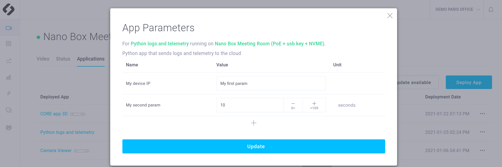
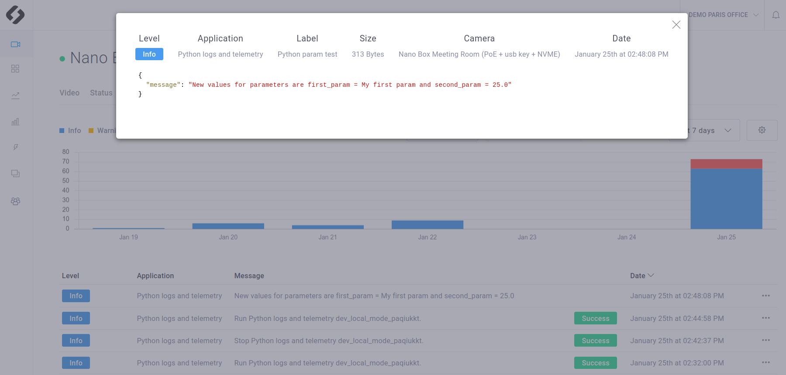

# **Tutorial 01 : Logs and Telemetry**

This tutorial shows you how to create a simple app notified when there is a parameter update from the CMP interface. This new value can then be used. 

## Requirements
You will deploy this tutorial on one of the devices installed on **your CMP workspace**. The CMP supports Jetson Nano, TX2 and Xavier or any computer. If you are using a Jetson, make sure it has been flashed. If you haven't done it already, [flash your Jetson](https://docs.nvidia.com/sdk-manager/install-with-sdkm-jetson/index.html).

To be able to run this tutorial:
- [Sign In the CMP and created a workspace](https://www.stereolabs.com/docs/cloud/overview/get-started/).
- [Add and Setup a device](https://www.stereolabs.com/docs/cloud/overview/get-started/#add-a-camera).

Note that you do not need a ZEd tu run this tutorial.

## package and deploy this tutorial

### How to Package your application
To packege your app just run:

```bash
$ cd /PATH/TO/tutorial_02_app_parameters
$ ./cmp_builder.sh
```

### How to deploy your application
`cmp_builder.sh` packages your app by generating an app.zip file. 
Now you just need to [deploy your app](https://www.stereolabs.com/docs/cloud/applications/sample/#deploy) using the CMP interface:

- In your workspace, in the **Applications** section, click on **Create a new app** 
- Get the .zip an **Drag’n’Drop** in the dedicated area
- Select the devices on which you want to deploy the app and press **Deploy** 

**Additional information about deployment and CMP apps :**

This README only focus on the source code explaination and the way to deploy the app without giving technical explaination about the app deployment. 
Please refer to the main README of this repository if you want more information about the CMP apps structure and technical precisions.  


## What you should see after deployment
This app is a simple app that update the parameters that have been changed. On update a log is sent.

### Modifing the app parameter
Wait until your app is **running**. 

In the **`Applications` panel of your device**, click on the figure that indicates the number of available parameters. A pop up window appears. You can modify the parameters value and update your changes.




### Parameters logs
Check that you received a log corresponding to the modification



## The Source Code explained

Setup a MQTT client that will publish logs and telemetry on the good topics. These topics must be : 

```python
logs_topic = "/v1/devices/" + device_id + "/logs"
telemetry_topic = "/v1/devices/" + device_id + "/telemetry"
```

```python
    #################       MQTT           ##################
    ## Starts alert mqtt client
    client.username_pw_set(mqtt_user, password=app_token)  # set username and password

    client.on_connect = on_connect  # attach function to callback
    client.on_disconnect = on_disconnect  # attach function to callback
    client.on_message = on_message  # attach function to callback
    client.on_publish = on_publish  # attach function to callback

    print("Connecting to broker")
    client.connect(broker_address, port=mqtt_port)  # connect to broker

    #################        start MQTT CLIENT thread            ##################
    client.loop_start()
```

An infinte while loop is here to never stop the app

```python
    #################                   ##################
    while True:
        time.sleep(10)
    return 0
```


When a parameter is modified on the cloud, a MQTT message is sent on `update_app_param_topic`
The message is received by the **MQTT client** and the `update_parameters` function is called
```python
def on_message(client, inference_thread_manager, message):
    '''
    Note that you must subscribe a topic to be able to receive messages (and of course a message must be published on this topic)
    '''

    if message.topic == update_app_param_topic:
        print("New parameter update received")
        new_app_parameters = json.loads(str(message.payload.decode()))
        update_parameters(new_app_parameters)

```


```python
def update_parameters(new_app_parameters):
    '''
    On new parameters, modify the environment variable value. 
    Then get the new environment variable value.
    '''
    for key, value in new_app_parameters.items():
        if "deployment.parameters.requested" in key:
            param_name = "SL_PARAM_APP_" + key.split("parameters.requested.")[-1]
            param_value = str(value)
            os.environ[param_name] = param_value
            print(param_name, "set to", param_value)
        else:
            print("the key",  key, " has been modified but is not an app parameter")

    ## get new value
    global first_param, second_param
    first_param = os.environ.get("SL_PARAM_APP_my_first_param")
    second_param = float(os.environ.get("SL_PARAM_APP_my_second_param"))

    ## send a log to notify new values
    my_message = "New values for parameters are first_param = "+ str(first_param) + " and second_param = " + str(second_param)
    log_message = generate_log_message(level = "INFO", message = my_message)
    client.publish(logs_topic, log_message)
```


