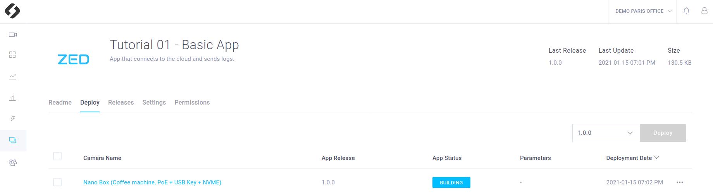
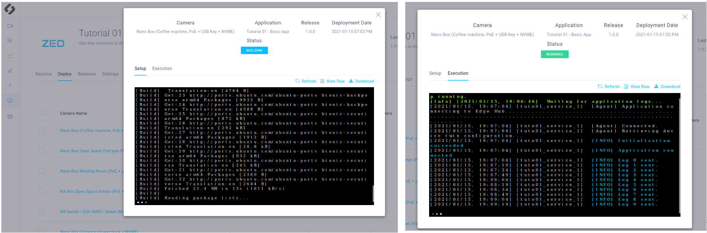
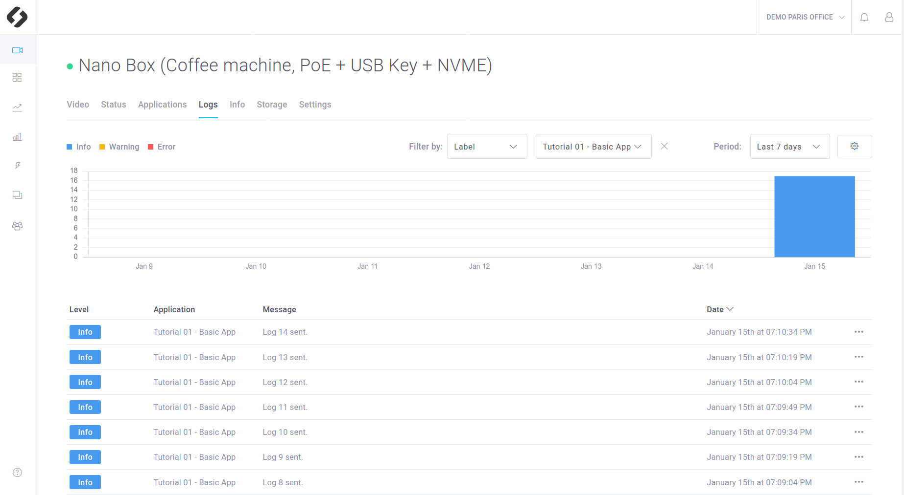

# Tutorial 1 : Basic App

> **NOTE**: The source code of this application and a code explaination are available [here](https://github.com/stereolabs/cmp-examples/tree/main/tutorials)

This sample shows how to make a very simple application that **connects** itself to the cloud and **sends logs**. This tutorial does not require a ZED.

## What you will obtain after deployment
This app is a minimalist app that only connect itself to the cloud and send logs (live stream is not provided by this app). It doesn't mean there is nothing to see:

###  App status
On the CMP interface you can consult the available applications list on your device. To do so, go in the Device panel. Click on the device where the app is deployed and go in the application section.
You should find a line corresponding to this tutorial, **"Tutorial 01 - Basic App"**.
The App status is displayed and indicates if your app is:
- Stopped
- Building
- Running
- Failed

Therefore you should see that the app is first in **building** state (for the first deployment it can last one minute or two) and finally **running**. 

### Terminal logs
If you click on the app status, you will have access to the app **logs in a terminal**, both for the building and the running stage.

###  App logs
Wait until your app is **running**.
If you click  on the device where the app is deployed and go in the **Logs** section, you should see three logs associated to this tutorial:
- "Initialization succeeded"
- "Application connected"
- "Log 1 sent" and a new one every 15 seconds.

## Deployment

### Requirements
You will deploy this tutorial on one of the devices installed on **your CMP workspace**. The CMP supports Jetson Nano, TX2 and Xavier or any computer. If you are using a Jetson, make sure it has been flashed. If you haven't done it already, [flash your Jetson](https://docs.nvidia.com/sdk-manager/install-with-sdkm-jetson/index.html).

To be able to run this tutorial:

- [Sign In the CMP and created a workspace](https://www.stereolabs.com/docs/cloud/overview/get-started/).
- [Add and Setup a device](https://www.stereolabs.com/docs/cloud/overview/get-started/#add-a-camera).

### How to deploy your application
You just need to [deploy your app](https://www.stereolabs.com/docs/cloud/applications/sample/#deploy) using the CMP interface:

- Select the devices on which you want to deploy the app 
- Click on the **Deploy** button
