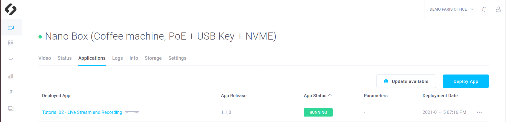

# Tutorial 2 - Live Stream and Continuous Recording

This tutorial shows how to deploy an application that starts a ZED camera and and sends the live stream to the CMP interface. You will also be able to store the video on your device.  The recorded video will be available on the CMP interface and downloadable. 

## Requirements
You will deploy this tutorial on one of the devices installed on your CMP workspace. The CMP supports Jetson Nano, TX2 and Xavier or any computer. If you are using a Jetson, make sure it has been flashed. If you haven't done it already, [flash your Jetson](https://docs.nvidia.com/sdk-manager/install-with-sdkm-jetson/index.html).

To be able to run this tutorial:

- [Sign In the CMP and created a workspace](https://www.stereolabs.com/docs/cloud/overview/get-started/).
- [Add and Setup a device](https://www.stereolabs.com/docs/cloud/overview/get-started/#add-a-camera).
- A ZED must be plugged to this device.
- **Enable recordings** and **disable privacy mode** in the Settings panel of your device


## Build and deploy this tutorial

### How to build your application
To build your app just run:

```
$ cd /PATH/TO/tutorial_01_basic_app
$ ./cmp_builder.sh
```

- The script will ask for the **device type** (jetson or classic x86 computer) on which you want to deploy this app. **Note** that it may be different than the computer on which you run `cmp_builder.sh`.
- The script will also ask for your **device cuda version**. If you do not know it you can find it in the **Info** section of your device in the CMP interface.
- Finally you will be asked the **IOT version** you want to use. It corresponds to the base docker imaged used to build your app docker image. You can chose the default one, or look for the [most recent version available on Dockerhub](https://hub.docker.com/r/stereolabs/iot/tags?page=1&ordering=last_updated).


### How to deploy your application
`cmp_builder.sh` packages your app by generating a app.zip file. 
Now you just need to [deploy your app](https://www.stereolabs.com/docs/cloud/applications/sample/#deploy) using the CMP interface:

- In your workspace, in the **Applications** section, click on **Create a new app** 
- Get the .zip an Drag’n’Drop in the dedicated area
- Select the devices on which you want to deploy  the app and press **Deploy** 

**Additional information about deployment and CMP apps :**

This README only focus on the source code explaination and the way to deploy the app without giving technical explaination about the app deployment. 
Please refer to the main README of this repository if you want more information about the CMP apps structure and technical precisions.  


## What you should see after deployment
This app have two direct consequences in the CMP interface:

- A live stream should be visible
- The available recording should be listed

### Live video
In the **Settings** panel of your device, make sure that the **Privacy mode** is disabled, otherwisethe video won't be visible.
Wait at least until your app is **running**. 



If you click in the **Devices** panel  on the device where the app is deployed, you should see the live video (with a delay of a few seconds).


### Recordings

In the **Settings** panel of your device, make sure that the **Enable Recording** parameter is set to True, otherwise the video won't be recorded. Keep **Recording Mode** on **Continuous**. It means that everything will be recorded. The only limit is your device Hard Drive storage. When there is no space left on it, the older recordings are **definitly erased**. (see tutorial_07_video_event to understand the **On Event** recording mode).

It is the only thing to do to start recording. The recordings are listed by hour and day in the **Video** panel of your device. 


## The Source Code explained

This sample app starts a ZED and get every frame. Then the application gets the camera position and sends it to the cloud at each frame. Therefore the Telemetry panel will contain all the concecutive position of your camera.  

What exactly appends:

- Init IOT to enable communications with the cloud. Note that compared to tutorial 1 where no ZED was required, here the cloud is init with a ZED pointer p_zed.

```cpp
    // Create camera object
    std::shared_ptr<sl::Camera> p_zed;
    p_zed.reset(new sl::Camera());

    //Init sl_iot
    const char * application_token = ::getenv("SL_APPLICATION_TOKEN");
    STATUS_CODE status_iot = IoTCloud::init(application_token, p_zed);
```


- Open the ZED with `p_zed->open(initParameters)`. [ZED Documentation](https://www.stereolabs.com/docs/video/camera-controls/#camera-configuration)

```cpp
    //Open the ZED camera
    sl::InitParameters initParameters;
    initParameters.camera_resolution = RESOLUTION::HD2K;
    initParameters.depth_mode = DEPTH_MODE::NONE;

    sl::ERROR_CODE status_zed = p_zed->open(initParameters);
```


- In a While loop, grab a new frame and call `IoTCloud::refresh()`. Note that the `refresh` is responsible for both **live stream** and **recording**. The image sent correspond of course to the image grabed, so to current frame.


```cpp
    // Main loop
    while (true) {
        // Grab a new frame from the ZED
        status_zed = p_zed->grab();
        if (status_zed != ERROR_CODE::SUCCESS) break;
        
        // Insert custom code here

        // Always refresh IoT at the end of the grab loop
        IoTCloud::refresh();
    }
```

## Custom stream

The CMP support custom stream, meaning you can send as live video the video of your choice. Have a look to **tutorial_06_custom_stream** to learn more about this feature.
