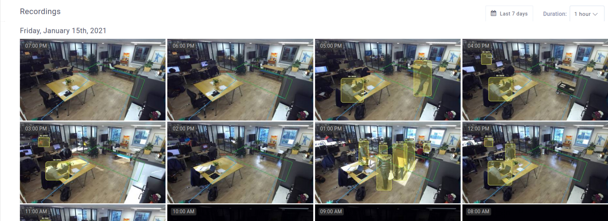

# Tutorial 2 - Live Stream and Continuous Recording

This tutorial shows how to deploy an application that starts a ZED camera and sends the live stream to the ZED Hub interface. You will also be able to store the video on your device. The recorded video will be available on the ZED Hub interface and downloadable.

## Requirements
You will deploy these tutorials on a device installed on your ZED Hub workspace. ZED Hub supports Jetson L4T and Ubuntu operating systems. If you are using a Jetson, make sure it has been flashed beforehand. If you haven't done it already, please take a look at the NVIDIA documentation to [flash your Jetson](https://docs.nvidia.com/sdk-manager/install-with-sdkm-jetson/index.html).

To be able to run this tutorial:
- [Sign in to ZED Hub and create a workspace](https://www.stereolabs.com/docs/cloud/overview/get-workspace/).
- [Add and setup a device](https://www.stereolabs.com/docs/cloud/overview/setup-device/).
- A ZED must be plugged to this device.
- **Enable recordings** and **disable privacy mode** in the Settings panel of your device

This tutorial needs Edge Agent. By default when your device is setup, Edge Agent is running on your device.

You can start it using this command :
```
$ edge_cli start
```

> **Note**: It is already running by default after Edge Agent installation.

And to stop it :
```
$ edge_cli stop
```

## Build and run this tutorial for development

With Edge Agent installed and running, you can build this tutorial with the following commands :
```
$ mkdir build
$ cd build
$ cmake ..
$ make -j$(nproc)
```

Then run your app :
```
./ZED_Hub_Tutorial_2
```

## What you should see after deployment
This app have two direct consequences in the ZED Hub interface:
- A live stream should be visible
- The available recording should be listed

### Live video
In the **Settings** panel of your device, make sure that the **Privacy mode** is disabled, otherwise the video won't be visible.

If you click in the **Devices** panel on the device where the app is deployed, you should see the live video (with a delay of a few seconds).


### Recordings

In the **Settings** panel of your device, make sure that the **Enable Recording** parameter is set to `True`, otherwise the video won't be recorded. Keep **Recording Mode** on **Continuous**. It means that everything will be recorded. The only limit is your device Hard Drive storage. When there is no space left on it, the older recordings are **erased**.

It is the only thing to do to start recording. The recordings are listed by hour and day in the **Video panel** of your device.




## The Source Code explained

This tutorial starts a ZED and retrieves every frame. Then, the application gets the camera position and sends it to the cloud at each frame. Therefore the **Telemetry panel** will contain all the consecutive position of your camera.

What exactly happens:

- Initialize communications with the cloud.

```cpp
    // Initialize the communication to ZED Hub, with a zed camera.
    std::shared_ptr<sl::Camera> p_zed;
    p_zed.reset(new sl::Camera());

    STATUS_CODE status_iot;
    status_iot = HubClient::connect("streaming_app");
    if (status_iot != STATUS_CODE::SUCCESS)
    {
        std::cout << "Initialization error " << status_iot << std::endl;
        exit(EXIT_FAILURE);
    }
```


- Open the ZED camera with `p_zed->open(initParameters)` ([ZED Documentation](https://www.stereolabs.com/docs/video/camera-controls/#camera-configuration)).

```cpp
    // Open the ZED camera
    sl::InitParameters initParameters;
    initParameters.camera_resolution = RESOLUTION::HD2K;
    initParameters.depth_mode = DEPTH_MODE::PERFORMANCE;

    sl::ERROR_CODE status_zed = p_zed->open(initParameters);
    if (status_zed != ERROR_CODE::SUCCESS)
    {
        HubClient::sendLog("Camera initialization error : " + std::string(toString(status_zed)), LOG_LEVEL::ERROR);
        exit(EXIT_FAILURE);
    }
```

- Register the ZED camera.
```cpp
    // Register the camera once it's open
    UpdateParameters updateParameters;
    status_iot = HubClient::registerCamera(p_zed, updateParameters);
    if (status_iot != STATUS_CODE::SUCCESS)
    {
        std::cout << "Camera registration error " << status_iot << std::endl;
        exit(EXIT_FAILURE);
    }
```

- In a **While loop**, grab a new frame and call `HubClient::update`.
> **Note**: The `update` is responsible for both **live stream** and **recording**. The sent image corresponds of course to the grabbed image, so to current frame.


```cpp
    // Main loop
    while (true)
    {
        // Grab a new frame from the ZED
        status_zed = p_zed->grab();
        if (status_zed != ERROR_CODE::SUCCESS)
            break;

        // Do what you want with the data from the camera.
        // For examples of what you can do with the zed camera, visit https://github.com/stereolabs/zed-examples
        // For example, you can retrieve a depth image.
        p_zed->retrieveImage(depth, VIEW::DEPTH);

        // Always update Hub at the end of the grab loop
        // without giving a sl::Mat, it will retrieve the RGB image automatically.
        // without giving a registered camera, it will try to update all registered cameras.
        HubClient::update(p_zed, depth);
    }
```

## Custom stream

The ZED Hub supports custom streams, meaning you can send as live video the video of your choice. To do that, just add the `sl::Mat` you built as an additional argument of `update()`.
