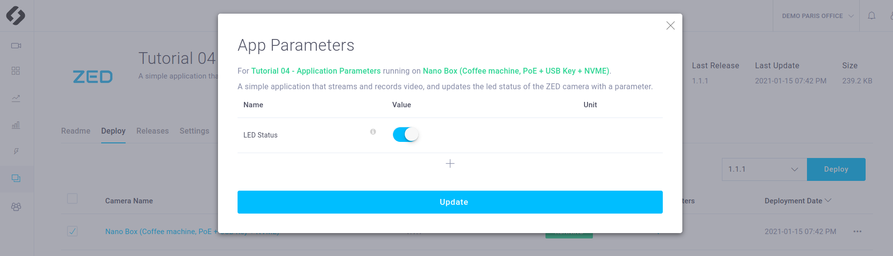
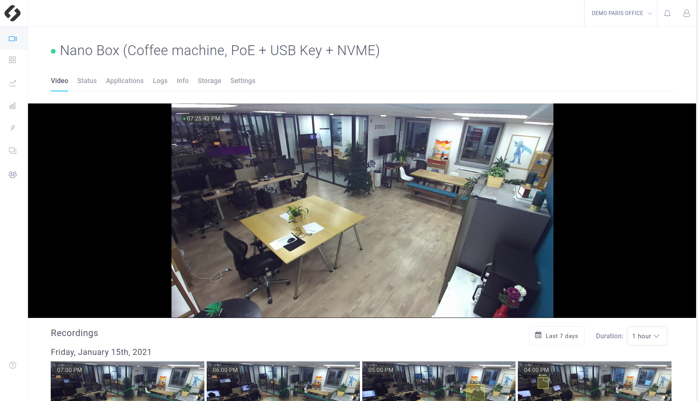

# Tutorial 4 - Application Parameters
> **NOTE**: The source code of this application and a code explaination are available [here](https://github.com/stereolabs/cmp-examples/tree/main/tutorials)

This tutorial shows how to use custom application parameters in your application. These parameters can be modified by everyone in the CMP interface.
This sample starts a ZED exactly as tutorial_02_live_stream_and_recording does, but it also define one parameter. The first one indicates whether the camera LED must be on or off.  

## What you will obtain after deployment
The app should be exactly the same than tutorial_02_live_stream_and_recording's app. It means that you should be able to see the live video and the recordings list in the CMP interface. In addition the two parameters should be visible in the interface: they are part of your application description in **the `Applications` panel of your device**.

### Modifing the app parameter
Wait until your app is **running**. 

In the **`Applications` panel of your device**, click on the figure that indicates the number of available parameters. A pop up window appears. You can modify the parameters value and update your changes. In our exemple you can turn the ZED LED on and off thanks to the parameters and verifie it work by checking that the LED does turn on and off.

### Live video
Wait at least until your app is **running**. 
If you click in the **Video** panel  on the device where the app is deployed, you should see the live video (with a delay of a few seconds).

## Deployment

### Requirements
You will deploy this tutorial on one of the devices installed on your CMP workspace. The CMP supports Jetson Nano, TX2 and Xavier or any computer. If you are using a Jetson, make sure it has been flashed. If you haven't done it already, [flash your Jetson](https://docs.nvidia.com/sdk-manager/install-with-sdkm-jetson/index.html).

To be able to run this tutorial:
- [Sign In the CMP and created a workspace](https://www.stereolabs.com/docs/cloud/overview/get-started/).
- [Add and Setup a device](https://www.stereolabs.com/docs/cloud/overview/get-started/#add-a-camera).
- A ZED must be plugged to this device.
- **Enable recordings** and **disable privacy mode** in the Settings panel of your device

### How to deploy your application
You just need to [deploy your app](https://www.stereolabs.com/docs/cloud/applications/sample/#deploy) using the CMP interface:

- Select the devices on which you want to deploy the app 
- Click on the **Deploy** button
