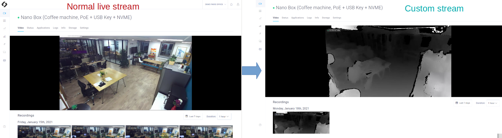

# Tutorial 6 - Custom Stream

> **NOTE**: The source code of this application and a code explaination are available [here](https://github.com/stereolabs/cmp-examples/tree/main/tutorials)

This application shows how to change the default live stream of an application, and use a custom one. In this tutorial we decided to display the ZED depth image as custom stream (instead of the RGB one, displayed by default). Please have a look to tutorial_02_live_stream_and_recording as it is used as starting point. 
 

## What you will obtain after deployment
This app modifies the live stream available on the CMP interface. Instead of the RGB image you should now see the ZED depth image.

- In the **Settings** panel of your device, make sure that the **Privacy mode** is disabled, otherwisethe video won't be visible.

- Wait at least until your app is **running**. 

- If you click in the **Devices** panel  on the device where the app is deployed, you should see the custom live video (with a delay of a few seconds). Instead of the RGB image you should now see the ZED depth image. 

## Deployment

### Requirements
You will deploy this tutorial on one of the devices installed on your CMP workspace. The CMP supports Jetson Nano, TX2 and Xavier or any computer. If you are using a Jetson, make sure it has been flashed. If you haven't done it already, [flash your Jetson](https://docs.nvidia.com/sdk-manager/install-with-sdkm-jetson/index.html).

To be able to run this tutorial:

- [Sign In the CMP and created a workspace](https://www.stereolabs.com/docs/cloud/overview/get-started/).
- [Add and Setup a device](https://www.stereolabs.com/docs/cloud/overview/get-started/#add-a-camera).
- A ZED must be plugged to this device.
- **Enable recordings** and **disable privacy mode** in the Settings panel of your device

### How to deploy your application
You just need to [deploy your app](https://www.stereolabs.com/docs/cloud/applications/sample/#deploy) using the CMP interface:

- Select the devices on which you want to deploy the app 
- Click on the **Deploy** button
