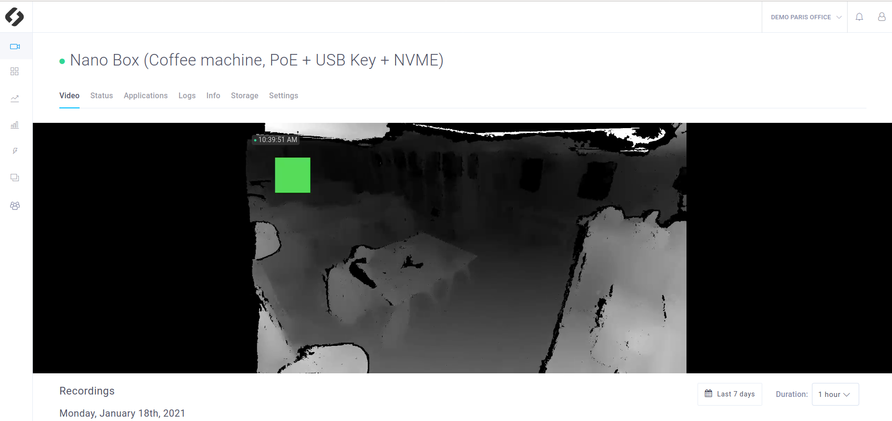

# Tutorial 6 - Custom Stream

This application shows how to change the default live stream of an application, and use a custom one. In this tutorial we decided to display the ZED depth image as custom stream (instead of the RGB one, displayed by default). Please have a look to tutorial_02_live_stream_and_recording as it is used as starting point. 

[**Github repository**](https://github.com/stereolabs/cmp-examples/tree/main/tutorials/tutorial_06_custom_stream)

## Requirements
You will deploy this tutorial on one of the devices installed on your ZEDHub workspace. The ZEDHub supports Jetson Nano, TX2 and Xavier or any computer. If you are using a Jetson, make sure it has been flashed. If you haven't done it already, [flash your Jetson](https://docs.nvidia.com/sdk-manager/install-with-sdkm-jetson/index.html).

To be able to run this tutorial:
- [Sign In the ZEDHub and created a workspace](https://www.stereolabs.com/docs/cloud/overview/get-started/).
- [Add and Setup a device](https://www.stereolabs.com/docs/cloud/overview/get-started/#add-a-camera).
- A ZED must be plugged to this device.
- **Enable recordings** and **disable privacy mode** in the Settings panel of your device

This tutorial needs Edge Agent. By default when your device is setup, Edge Agent is running on your device.

You can start it using this command, and stop it with CTRL+C (note that it's already running by default after Edge Agent installation) :
```
$ edge_cli start
```

If you want to run it in backround use :
```
$ edge_cli start -b
```

And to stop it :
```
$ edge_cli stop
```

## Build and deploy this tutorial

### How to build your application (for development)

Run the Edge Agent installed on your device using (note that it's already running by default after Edge Agent installation) :
```
$ edge_cli start
```

Then to build your app :
```
$ cd sources
$ mkdir build
$ cd build
$ cmake ..
$ make -j$(nproc)
```

Then to run your app :
```
./app_executable
```

## What you should see after deployment
This app modifies the live stream available on the ZEDHub interface. Instead of the RGB image you should now see the ZED depth image.

- In the **Settings** panel of your device, make sure that the **Privacy mode** is disabled, otherwisethe video won't be visible.

- If you click in the **Devices** panel  on the device where the app is deployed, you should see the custom live video (with a delay of a few seconds). Instead of the RGB image you should now see the ZED depth image. 


## Code overview

### Initialization

Init IOT to enable communications with the cloud. Note that the cloud is init with a ZED pointer p_zed.

```cpp
    // Create camera object
    std::shared_ptr<sl::Camera> p_zed;
    p_zed.reset(new sl::Camera());

    //Init sl_iot
    const char * application_token = ::getenv("SL_APPLICATION_TOKEN");
    STATUS_CODE status_iot = IoTCloud::init(application_token, p_zed);
```

Then, your ZED Camera is opened with the ZED SDK. The depth is activated in order to use it in the custom stream.
```c++
    sl::InitParameters initParameters;
    initParameters.camera_resolution = RESOLUTION::HD720;
    initParameters.depth_mode = DEPTH_MODE::ULTRA;

    sl::ERROR_CODE status_zed = p_zed->open(initParameters);
```

### Main loop and Custom Stream

The main loop of your application grabs the images from the camera with the ```grab``` function.
Then the depth image is retrieve with `retrieveImage`, stored in `imgLeftCustom` and set as custom image with `setStreamImage`.
Finaly the `IoTCloud::refresh` function sends this live stream to the ZEDHub interface and handle recording depending on the interface settings.

```c++
    sl::Mat imgLeftCustom;

    // Main loop
    while (true) {
        // Grab a new frame from the ZED
        status_zed = p_zed->grab();
        if (status_zed != ERROR_CODE::SUCCESS) break;

        // Retrieve depth image
        p_zed->retrieveImage(imgLeftCustom, sl::VIEW::DEPTH, sl::MEM::CPU);

        // Use this function to set the current image of your live stream
        IoTCloud::setCustomVideoMat(imgLeftCustom);
        // Always refresh IoT at the end of the grab loop
        IoTCloud::refresh();
    }
```

### Using OpenCV
You can also modify your live stream using openCV. This feature is not integrated to this tutorial in order to keep it as simple as possible. This part shows you how to modify an image by adding a simple green square. 



Here is what you have to modify to use OpenCV:

#### Add OpenCV to your Docker images
The build and runtime docker images must have openCV installed. **Note that it is already done in this tutorial.**


You just would have to add `libopencv-dev` in the two Dockerfile as follow (already done): 

Dockerfile.build
```Dockerfile
ARG BASE_IMAGE
FROM ${BASE_IMAGE} AS builder

#Install build dependencies
RUN apt-get update -y && \
DEBIAN_FRONTEND=noninteractive apt-get install -y tzdata libx11-dev  && \
apt-get install -y --no-install-recommends libopencv-dev && \
     rm -rf /var/lib/apt/lists/* && apt autoremove && apt clean

```

Dockerfile.runtime

```Dockerfile
ARG BASE_IMAGE
FROM ${BASE_IMAGE}


#Install build dependencies
RUN apt-get update -y && \
DEBIAN_FRONTEND=noninteractive apt-get install -y tzdata libx11-dev  && \
apt-get install -y --no-install-recommends libopencv-dev && \
     rm -rf /var/lib/apt/lists/* && apt autoremove && apt clean

```

#### Use OpenCV to modify each image of the video

Note that the `CMakeLists.txt` has already been modified to link the app to OpenCV.
Therefore you just need to modify the c++ code:

Add the OpenCV header:
```c++
#include <opencv2/opencv.hpp>
```

Add this function to the main.cpp of this tutorial.

```c++
cv::Mat slMat2cvMat(Mat& input) {
    // Mapping between MAT_TYPE and CV_TYPE
    int cv_type = -1;
    switch (input.getDataType()) {
    case MAT_TYPE::F32_C1: cv_type = CV_32FC1; break;
    case MAT_TYPE::F32_C2: cv_type = CV_32FC2; break;
    case MAT_TYPE::F32_C3: cv_type = CV_32FC3; break;
    case MAT_TYPE::F32_C4: cv_type = CV_32FC4; break;
    case MAT_TYPE::U8_C1: cv_type = CV_8UC1; break;
    case MAT_TYPE::U8_C2: cv_type = CV_8UC2; break;
    case MAT_TYPE::U8_C3: cv_type = CV_8UC3; break;
    case MAT_TYPE::U8_C4: cv_type = CV_8UC4; break;
    default: break;
    }

    return cv::Mat(input.getHeight(), input.getWidth(), cv_type, input.getPtr<sl::uchar1>(MEM::CPU));
}
```


Replace the main loop of this sample by this code:
```c++
    sl::Mat imgLeftCustom(1280,720, sl::MAT_TYPE::U8_C4);
    cv::Mat depthImageCpuCV;
    depthImageCpuCV = slMat2cvMat(imgLeftCustom);

    // Main loop
    while (true) {
        // Grab a new frame from the ZED
        status_zed = p_zed->grab();
        if (status_zed != ERROR_CODE::SUCCESS) break;

        // Retrieve depth image
        p_zed->retrieveImage(imgLeftCustom, sl::VIEW::DEPTH, sl::MEM::CPU, imgLeftCustom.getResolution());

        // Draw box 
        cv::Point tl(100, 100);
        cv::Point br(200, 200);
        cv::Scalar color = cv::Scalar(100,200,75);
        cv::rectangle(depthImageCpuCV, tl, br, color, cv::FILLED);

        // Use this function to set the current image of your live stream
        IoTCloud::setCustomVideoMat(imgLeftCustom);

        // Always refresh IoT at the end of the grab loop
        IoTCloud::refresh();
    }
```

In addition to the  `sl::Mat`, a` cv::Mat` is declared and points on the same pointer than the `sl::Mat`. When `depthImageCpuCV` is modified,`imgLeftCustom` is modified too. 

Build the application with a **new release name** (to be modified in **app.json**) and deploy it anew.
```
     "release":{
        "name": "1.0.1",
```
A filled rectangle is drawn and should be visible in the **Video panel**.
