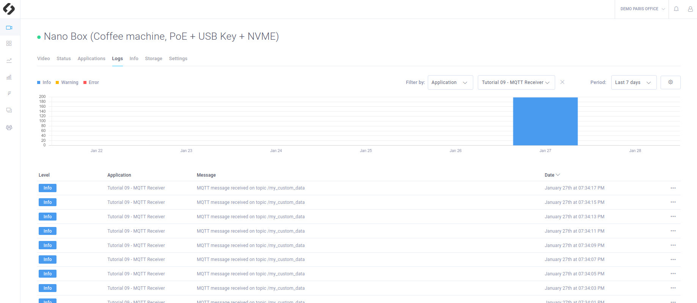

# Tutorial 8 - MQTT Subscriber

> **Note**: This tutorial should be run with the [tutorial 7 : **MQTT Publisher**](/tutorials/tutorial_07_mqtt_publisher/README.md).

This tutorial shows you how to communicate between apps through ZED Hub. It subscribes to a MQTT topics and send a log to notify that the messages have been received.

## Requirements
You will deploy these tutorials on a device installed on your ZED Hub workspace. ZED Hub supports Jetson L4T and Ubuntu operating systems. If you are using a Jetson, make sure it has been flashed beforehand. If you haven't done it already, please take a look at the NVIDIA documentation to [flash your Jetson](https://docs.nvidia.com/sdk-manager/install-with-sdkm-jetson/index.html).

To be able to run this tutorial:
- [Sign in to ZED Hub and create a workspace](https://www.stereolabs.com/docs/cloud/overview/get-workspace/).
- [Add and setup a device](https://www.stereolabs.com/docs/cloud/overview/setup-device/).

This tutorial needs Edge Agent. By default when your device is setup, Edge Agent is running on your device.

You can start it using this command :
```
$ edge_cli start
```

> **Note**: It is already running by default after Edge Agent installation.

And to stop it :
```
$ edge_cli stop
```

## Build and run this tutorial for development

With Edge Agent installed and running, you can build this tutorial with the following commands :
```
$ mkdir build
$ cd build
$ cmake ..
$ make -j$(nproc)
```

Then run your app :
```
./ZED_Hub_Tutorial_8
```

## What you should see after deployment

The app subscribes to the MQTT topic where the MQTT Publisher Tutorial publishes: `/v1/local_network/my_custom_data`. A log is published each time a message is received.




## Code overview
The app must be **initialized** to be connected to the local Broker.
The app subscribes to the topic `/v1/local_network/my_custom_data` composed of the topic prefix `/v1/local_network` and the topic name `my_custom_data`.
When a message is received the callback `onDataReceived` is triggered.

```c++
    // Initialize the communication to ZED Hub, without a zed camera.
    STATUS_CODE status_hub;
    status_hub = HubClient::connect("sub_app");
    if (status_hub != STATUS_CODE::SUCCESS)
    {
        std::cout << "Initialization error " << status_hub << std::endl;
        exit(EXIT_FAILURE);
    }

    // Topic to listen to
    std::string topic_name = "/my_custom_data";
    HubClient::subscribeToTopic(topic_name, onDataReceived);
```

`onDataReceived` is defined as follows. Each time a message is received, a log is sent and the message is also displayed in the runtime terminal.

```c++
void onDataReceived(const std::string &topic, const std::string &message, TARGET target)
{
    std::cout << "Message received !" << std::endl;
    json my_raw_data = json::parse(message);
    std::cout << "My received message : " << my_raw_data << std::endl;
    HubClient::sendLog("Message received on topic " + topic, LOG_LEVEL::INFO);
}
```
